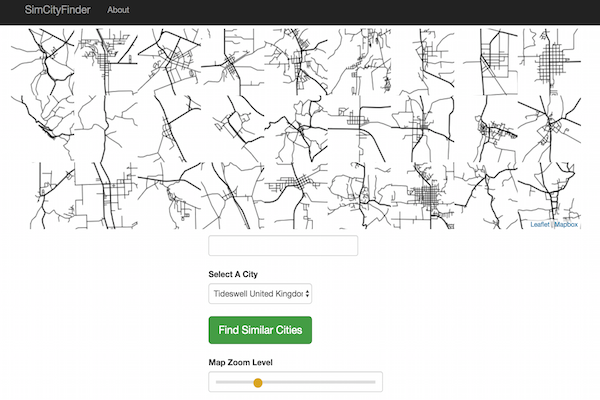
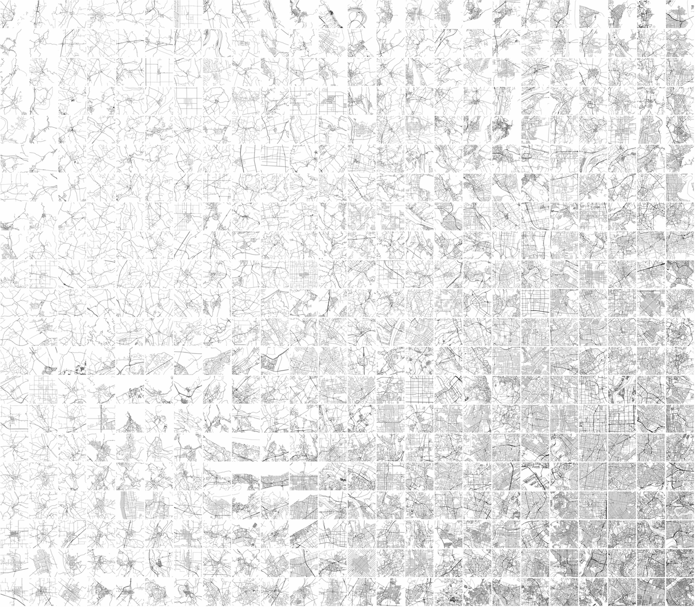

# Urban Morphology Meets Deep Learning
## Basic Idea
Urban morphology is the study of "urban forms" and their underlying formation processes and forces over time. Here, by urban or city form, we main the combination of street networks, building patterns and their overall layout.
Classically, urban morphologist study cities based on few features (usually learned from few famous cities) such as medieval cities (with concentric patterns), industrial cities with grids or highways, ecological cities with polycentric patterns and so on. Later these known features can be used for urban analysis and design. In terms of machine learning this is similar to use of engineered features or a given representations of objects, usually known by experts.
On the other hand, now for the first time in the history we have access to both Big Data and Machine learning that work well together.
In terms of Machine learning, the main questions in urban morphology can be translated to unsupervised tasks such as pattern recognition, clustering and feature learning or in to supervised tasks such as finding the relationships between city forms and different quantitative aspects such as total energy consumptions, transport quality or air pollution to just name few. 
Therefore, availability of massive urban data collections such as Open Street Map from the one hand and the recent advancements in machine learning methods on the other can open up new approaches to investigate urban patterns at a global scale.
Currently there are more than 1.1 million cities, towns and villages indexed in Open Street Map (OSM) and our goal in this project is to learn a hierarchical representation of these places via their street networks and later considering several other layers such as building information.
Below is a visualization of these extracted locations across the world.

[High resolution image](https://sevamoo.github.io/roadsareread/Images/mapof_all_8325.png)

Further, there is an interactive map, where you can zoom in to different areas of the world.
- [An interactive map showing the center of cities, towns and villages](https://sevamoo.github.io/cityastext/docs/dotmap.html)

## First Experimental Set Up
In the first set of experiments, we were focused only on 65 thousands of these locations. Using a styled map from [Mapbox Studio](https://www.mapbox.com/mapbox-studio/), which only shows the road networks, and the Mapbox static API, we collected the images of the road networks of the selected locations, all with the same view and scale.
The video below shows a random series of produced images.

Secondly, using the collected images of the city networks, we trained a **Convolutional Auto-Encoder** (CAE), where similar to other auto-encoders, the middle layer can be seen as a dense representation of the input data. Later these dense vectors can be used to map similar data points (here, cities) next to each other.
In order to just test the quality of the learned dense representations of each city, we developed a simple framework based on K-NN (with K=6) algorithm, where by selecting a specific city by user, the system finds K other similar cities. As expected from Convolutional Networks, the following figure shows that the learned vectors are keeping lots of information about overall form as well as translation, orientation, density of the road networks. In each row the left city is the query and the rest are the K most similar city patterns.

Further, we developed a simple web application, where user can interactively see these results for few thousands of these cities. 

Further, in order to create a two dimensional visualization of all of these 65k cities, we trained a Self Organizing Map (SOM) by the  encoding vectors of the trained CAE. The SOM assigns a two dimensional index to each data point in a way that similar data points get similar indexes. As a result, we will have a spectrum of city maps. Bellow is a visualization of around 25K cities using SOM algorithm.

Further, here is a short clip showing transitions between different forms, learned by convolutional autoencoders and a one dimensional SOM

**The codes and the final results in a proper format to be published here soon.**

