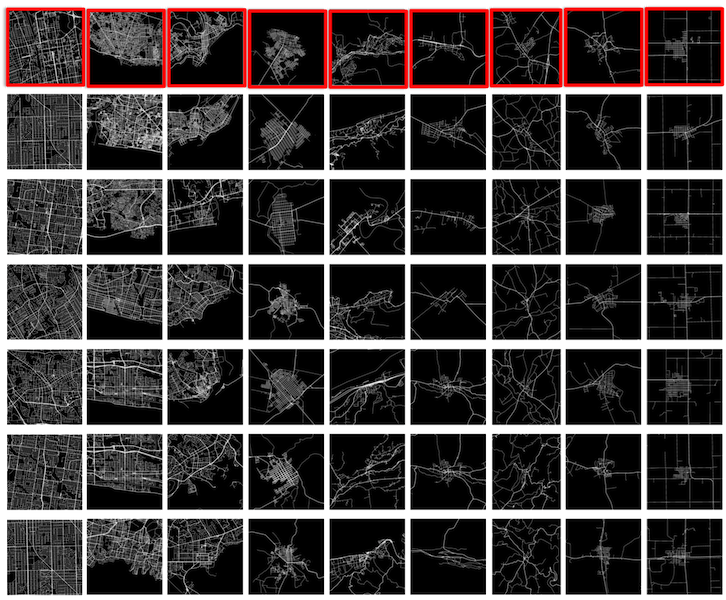

# Roads Are Read, Buildings Blue: Urban Morphology Meets Deep Learning
## The main goal of this project is to see how it is possible to learn hierarchies of urban patterns, using the so called "representation learning" methods such as convolutional neural networks and a big collection of images of more than 75K cities across the world .  
* **Keywords: Urban Morphology, Big Data, Deep Learning, Hierarchical Representation, ....**

* **Dot map of the centers of more than 1.1 million cities, towns and villages, extracted from OSM planet (all to be used in the next experiments)**

[High resolution image](https://sevamoo.github.io/roadsareread/Images/mapof_all_8325.png)

- [An interactive map showing the center of cities, towns and villages](https://sevamoo.github.io/roadsareread/dotmap.html)

- **A short clip showing few thousands of these images quickly**

* The codes and the final results in a proper format to be published here soon.
- [Low dimensional visualization of the learned dense vectors](https://drive.google.com/file/d/0B9Z7rVJcvzQASk5pNmUwdmhNc3c/view?usp=sharing) 
- [Some examples of the most similar cities to a selected city](https://gitpitch.com/sevamoo/roadsareread/master)

- [A simple webmap, which shows similar cities to a selected city](https://sevamoo.github.io/cityfinder/)

- **A short clip showing transitions between different forms, learned by convolutional autoencoders and a one dimensional SOM**

